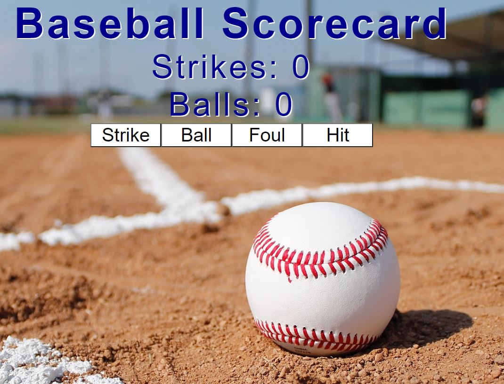

## Baseball Scorecard App
- A React App to keep score of a baseball game
- Hosted on Heroku [here](https://baseball-scorecard.herokuapp.com/)

## Screenshot


### Instructions
- Clone the repo
- Change directory to baseball-scorecard
- Run ```npm install```
- To run the app run ```npm start```
- The app will auto load in a web browser

### The Game
- There are buttons for strikes, balls, fouls and hits
- Balls and Strikes reset on 3rd strike or 4th ball
- Foul increases strikes by 1 if there are less than 2 strikes
- Clicking 'Hit' resets strikes and Balls

### Tech used
- React
- CSS

### Testing
- Jest / React testing library

### Coverage
File                 | % Stmts | % Branch | % Funcs | % Lines | Uncovered Lines
---------------------|---------|----------|---------|---------|-------------------
All files            |   63.64 |       50 |   77.78 |    62.5 |
 src                 |   58.62 |       50 |   71.43 |   57.14 |
  App.js             |   89.47 |    83.33 |     100 |   88.89 | 11-12
  index.js           |       0 |      100 |     100 |       0 | 7-17
  reportWebVitals.js |       0 |        0 |       0 |       0 | 1-8
 src/components      |     100 |      100 |     100 |     100 |
  Controls.js        |     100 |      100 |     100 |     100 |
  Display.js         |     100 |      100 |     100 |     100 |
